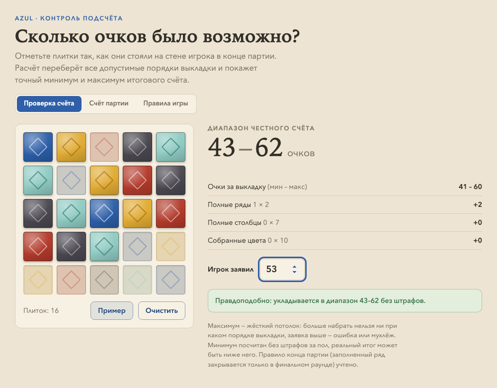
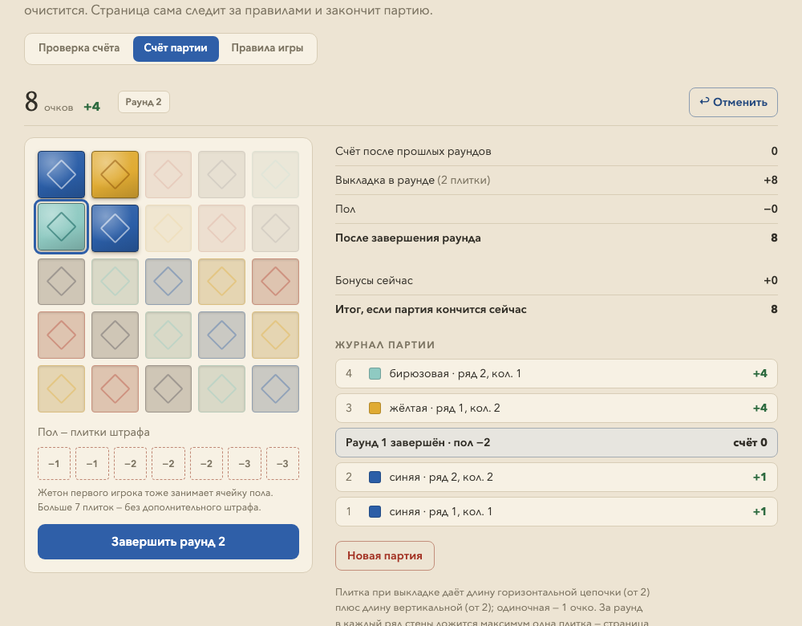
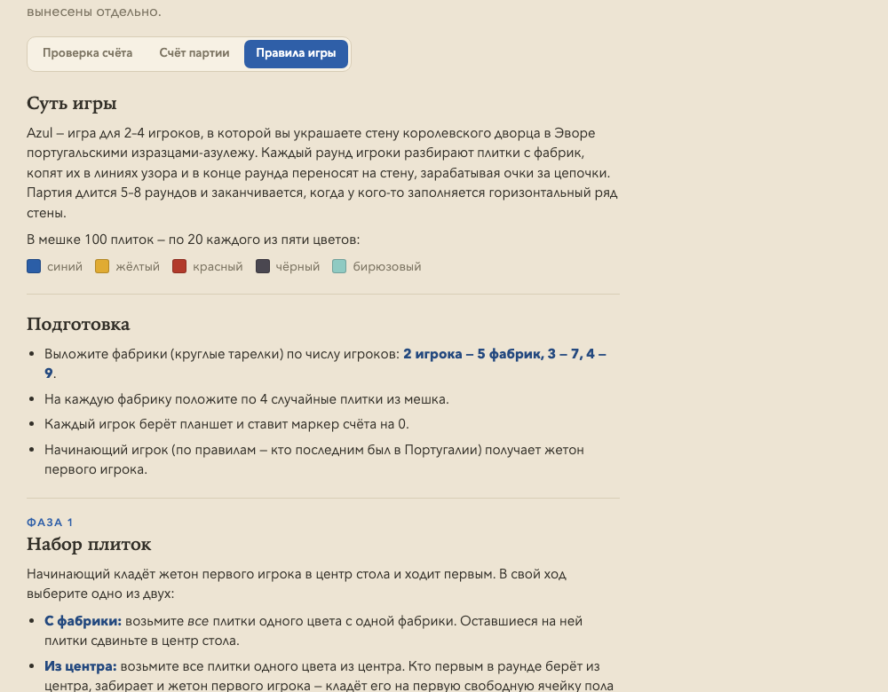

# Azul Score — счёт партии и контроль подсчёта очков

**Живая версия: [azul.petrochenko.info](https://azul.petrochenko.info)**

Веб-инструмент для настольной игры [Azul](https://ru.wikipedia.org/wiki/Azul): ведёт счёт партии по раундам, а после партии проверяет заявленный соперником счёт — точной комбинаторикой, без прикидок. Родился из простого вопроса: «а не приписал ли он себе лишнего?».

Один самодостаточный HTML-файл, ноль зависимостей, работает на телефоне.

## Возможности

### Проверка счёта

Отметьте плитки так, как они стояли на стене игрока в конце партии, — страница вычислит **точный минимум и максимум** очков, достижимых с такой конфигурацией, и вынесет вердикт по заявленному счёту:

- заявка **выше максимума** — невозможно ни при каком порядке выкладки: ошибка или мухлёж;
- заявка **в диапазоне** — правдоподобно;
- заявка **ниже минимума** — возможно только при штрафах за пол (показывается, сколько минимум штрафа это требует).



### Счёт партии

Полное ведение партии по правилам: отмечаете плитки в момент выкладки (очки за цепочки считаются сразу), заполняете пол тапами по ячейкам штрафа, завершаете раунд — штраф применяется, пол очищается. Страница сама:

- следит за правилом «одна плитка в ряд стены за раунд» и блокирует нарушения;
- не даёт счёту уйти ниже нуля;
- замечает заполненный ряд и завершает партию с автоматическим начислением бонусов;
- ведёт журнал всех ходов с построчной отменой (включая отмену завершения раунда);
- автосохраняет партию в localStorage — перезагрузка страницы ничего не теряет.



### Правила игры

Полная справка по Azul: подготовка, фазы раунда, ограничения линий узора, подсчёт, конец партии и отдельный раздел «Частые ошибки и споры».



## Как считается «честный диапазон»

Очки за выкладку в Azul зависят от **порядка** появления плиток на стене: плитка приносит длину своей горизонтальной цепочки (если ≥ 2) плюс длину вертикальной (если ≥ 2), одиночная — 1 очко. Одна и та же конечная стена могла быть выложена многими способами с разными суммами.

Ключевые наблюдения, на которых стоит расчёт:

1. **Любой порядок выкладки реализуем в реальной партии.** За раунд каждый ряд стены получает максимум одну плитку, но раундов может быть сколько угодно — значит, любую последовательность можно сыграть «по одной плитке за раунд». Поэтому пространство поиска — все перестановки плиток.
2. **Точный min/max — динамическим программированием по подмножествам.** Для каждого подмножества `S` выложенных плиток (`2^k` состояний, до `2^25`) считаем `dpMin[S]` / `dpMax[S]` — экстремумы суммы очков, перебирая последнюю положенную плитку. Очки плитки в состоянии считаются по предвычисленным цепочкам смежных заполненных клеток. Хранение — `Uint8Array`, расчёт разбит на чанки, чтобы не блокировать интерфейс; типичная конечная стена (15–22 плитки) считается мгновенно, полная стена из 25 — за секунды.
3. **Ограничение конца партии.** Если на стене есть полный ряд, его последняя плитка обязана лечь в финальном раунде (иначе партия закончилась бы раньше). Поэтому поверх DP перебираются все допустимые составы финального раунда (по одной «замыкающей» плитке на каждый полный ряд, опционально по одной из неполных, укладка сверху вниз — не более 5^5 комбинаций), и экстремумы берутся по формуле `dp[стена без финала] + очки финального раунда`.
4. **Бонусы** (ряд +2, столбец +7, цвет +10) от порядка не зависят и добавляются к диапазону.

Штрафы за пол проверяющему неизвестны, поэтому семантика границ такая: **максимум — жёсткий потолок** (мухлёж, если заявлено больше), а заявка ниже минимума сама по себе легальна — просто игрок терял очки на полу.

## Технические детали

- **Один файл**: [`site/index.html`](site/index.html) — разметка, стили и логика без сборки и внешних зависимостей.
- Светлая и тёмная темы (`prefers-color-scheme`), адаптив под телефон: крупные тапы, закреплённый счёт, без зума полей ввода.
- Состояние (партия, отмеченные плитки, активная вкладка) хранится в `localStorage`; при загрузке журнал партии валидируется повтором ходов с пересчётом очков — повреждённые данные отбрасываются.
- Кнопка «Пример» генерирует случайную правдоподобную конечную стену (верхние ряды плотнее, в 60% случаев есть полный ряд).

## Игра против бота

**[azul.petrochenko.info/play](https://azul.petrochenko.info/play)** — полная партия Azul 1 на 1 против ИИ (десктоп, от 1000px).

- **Движок правил** (`site/play/engine.js`) — чистые функции над JSON-состоянием, вся случайность через seed (mulberry32), 23 юнит-теста + фаззинг 1000 партий с инвариантами (в т.ч. сохранение всех 100 плиток по цветам).
- **Боты** (`site/play/bot.js`): уровень 1 — жадная эвристика; уровень 2 — минимакс с альфа-бета-отсечением до конца раунда (внутри раунда игра детерминирована) с итеративным углублением под тайм-бюджет и оценкой потенциала на границе раунда. L2 выигрывает у L1 **94.6%** партий (500 игр на стенде). Думает в Web Worker.
- **Турнирный стенд** (`tools/arena.mjs`) — детерминированные матчи бот-против-бота с интервалом Уилсона: `node tools/arena.mjs --a 2 --b 1 -n 500 --seed 1`.
- **Тренер**: кнопка «💡 Подсказка» — тот же L2 советует ход игроку с разбором «что даёт и почему» и стратегическими советами по позиции.
- **Графика** — керамика-азулежу, сгенерированная Nano Banana (`scripts/gen_assets.py`, gemini-2.5-flash-image): спрайт пяти плиток, тарелки фабрик, аватар бота.
- Разработка велась по спецификациям с субагентами-исполнителями и ревьюерами — процесс и спеки в [`specs/`](specs/).

Тесты всего проекта: `node --test` (движок + боты + стенд).

## Структура репозитория

```
site/index.html   — инструмент счёта одним файлом
site/play/        — игра против бота (engine.js, bot.js, bot-worker.js, index.html, assets/)
tools/arena.mjs   — турнирный стенд
tests/            — юнит-тесты (node --test)
scripts/          — генерация графики (Nano Banana)
specs/            — спецификации и процесс разработки
docs/*.png        — скриншоты для этого README
```

## Локальный запуск

Просто откройте `site/index.html` в браузере — серверов и сборки нет.

## Деплой

Сайт хостится на Cloudflare Pages (проект `azul-score`), домен подключён через CNAME:

```bash
wrangler pages deploy site --project-name azul-score --branch main
```

(требуются `CLOUDFLARE_EMAIL`, `CLOUDFLARE_API_KEY`, `CLOUDFLARE_ACCOUNT_ID` в окружении).

## Лицензия

[MIT](LICENSE)
